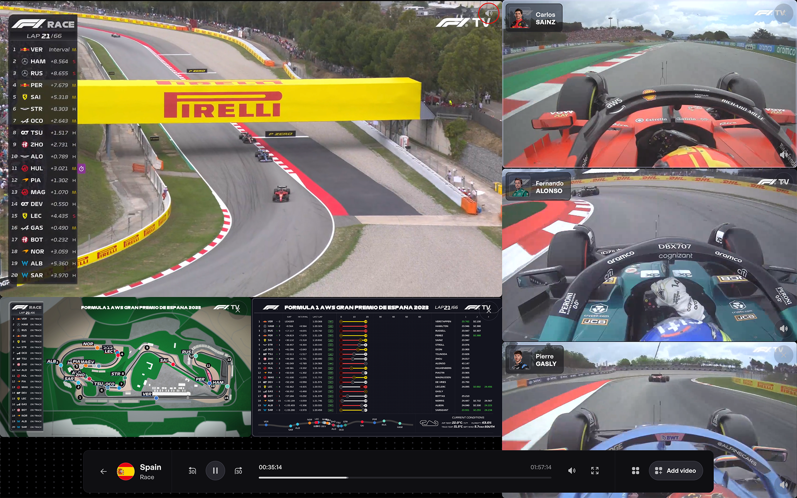

<!-- Improved compatibility of back to top link: See: https://github.com/othneildrew/Best-README-Template/pull/73 -->
<a name="readme-top"></a>
<!--
*** Thanks for checking out the Best-README-Template. If you have a suggestion
*** that would make this better, please fork the repo and create a pull request
*** or simply open an issue with the tag "enhancement".
*** Don't forget to give the project a star!
*** Thanks again! Now go create something AMAZING! :D
-->


<!-- PROJECT LOGO -->
<br />
<div align="center">
  <h3>
    <a href="https://github.com/bibixx/zium.app">
      
    </a>
  </h3>

  <p align="center">
    Formula 1 Multi-View Experience
    <br />
    <a href="https://zium.app">View App</a>
    ·
    <a href="https://github.com/bibixx/zium.app/issues">Report Bug</a>
    ·
    <a href="https://github.com/bibixx/zium.app/issues">Request Feature</a>
    ·
    <a href="https://www.craft.do/s/fffYcaZcBCUEFK">Features Roadmap</a>
  </p>
</div>


<!-- TABLE OF CONTENTS -->
<details>
  <summary>Table of Contents</summary>
  <ol>
    <li>
      <a href="#about-the-project">About The Project</a>
    </li>
    <li>
      <a href="#getting-started">Getting Started</a>
      <ul>
        <li><a href="#prerequisites">Prerequisites</a></li>
        <li>
          <a href="#installation">Installation</a>
          <ul>
            <li><a href="#ziumapp">zium.app</a></li>
          </ul>
        </li>
      </ul>
    </li>
    <li><a href="#roadmap">Roadmap</a></li>
    <li><a href="#contributing">Contributing</a></li>
    <li><a href="#license">License</a></li>
    <li><a href="#contact">Contact</a></li>
    <li><a href="#acknowledgements">Acknowledgements</a></li>
    <li><a href="#disclaimers">Disclaimers</a></li>
  </ol>
</details>


<!-- ABOUT THE PROJECT -->
## About The Project

<div align="center">
  <a href="https://zium.app">
    
  </a>
</div>

Want to feel like you're a race engineer during a Formula 1 race? With zium.app (_/[ʑ](https://en.wikipedia.org/wiki/Voiced_alveolo-palatal_fricative)[u](https://en.wikipedia.org/wiki/Close_back_rounded_vowel)[m](https://en.wikipedia.org/wiki/Voiced_bilabial_nasal) [d](https://en.wikipedia.org/wiki/Voiced_dental_and_alveolar_plosives)[ɒ](https://en.wikipedia.org/wiki/Open_back_rounded_vowel)[t](https://en.wikipedia.org/wiki/Voiceless_dental_and_alveolar_plosives) [æ](https://en.wikipedia.org/wiki/Near-open_front_unrounded_vowel)[p](https://en.wikipedia.org/wiki/Voiceless_bilabial_plosive)/_), you can watch the race from multiple angles at once, all inside your browser. The Multi-View Experience lets you create your own responsive pit-wall with multiple onboard cameras, race details and the main F1 TV broadcast.

> An active F1 TV subscription is required to access the video streams. zium.app doesn’t allow you to watch Formula 1 for free.

<p align="right">(<a href="#readme-top">back to top</a>)</p>


<!-- GETTING STARTED -->
## Getting Started

To get a local copy up and running follow these steps.

### Prerequisites

* [Node.js 16.18+](https://nodejs.org/en/download)
* [Yarn](https://yarnpkg.com/getting-started/install)

### Installation

#### zium.app
1. Clone the repo
   ```sh
   git clone https://github.com/bibixx/zium.app.git
   ```
2. Install NPM packages
   ```sh
   yarn install
   ```
3. Run app in the development mode
   ```sh
   yarn dev
   ```

#### Chrome Extension
1. Clone the repo
   ```sh
   git clone https://github.com/bibixx/zium.app.git
   ```
2. Enter the `extension` folder
   ```sh
   cd extension
   ```
2. Install NPM packages
   ```sh
   yarn install
   ```
3. Run extension in the development mode
   ```sh
   yarn dev
   ```
4. [Load the unpacked extension from the `extension/dist` folder](https://developer.chrome.com/docs/extensions/mv3/getstarted/development-basics/#load-unpacked)

> Domains that the **dev** extension considers the app to be in is: `localhost`, `*.zium.app`, `*.vercel.app`\
> Domains that the **production** (the one in Chrome store) extension considers the app to be in is: `*.zium.app`

<p align="right">(<a href="#readme-top">back to top</a>)</p>


<!-- ROADMAP -->
## Roadmap

<a href="https://www.craft.do/s/fffYcaZcBCUEFK">
  <div align="center">
    
  </div>
</a>


<p align="right">(<a href="#readme-top">back to top</a>)</p>


<!-- CONTRIBUTING -->
## Contributing

Contributions are what make the open source community such an amazing place to learn, inspire, and create. Any contributions you make are **greatly appreciated**.

If you have a suggestion that would make this better, please fork the repo and create a pull request. You can also simply open an issue with the tag "enhancement".
Don't forget to give the project a star! Thanks again!

1. Fork the Project
2. Create your Feature Branch (`git checkout -b feature/AmazingFeature`)
3. Commit your Changes (`git commit -m 'Add some AmazingFeature'`)
4. Push to the Branch (`git push origin feature/AmazingFeature`)
5. Open a Pull Request to the `dev` branch

<p align="right">(<a href="#readme-top">back to top</a>)</p>


<!-- LICENSE -->
## License

Copyright © 2023 Bartosz Legięć, Adam Ruthendorf-Przewoski

zium.app is free software: you can redistribute it and/or modify it under the terms of the GNU General Public License as published by the Free Software Foundation, either version 3 of the License, or (at your option) any later version.

zium.app is distributed in the hope that it will be useful, but WITHOUT ANY WARRANTY; without even the implied warranty of MERCHANTABILITY or FITNESS FOR A PARTICULAR PURPOSE. See the GNU General Public License for more details.

You should have received a copy of the GNU General Public License along with zium.app. If not, see https://www.gnu.org/licenses/.

<p align="right">(<a href="#readme-top">back to top</a>)</p>


<!-- CONTACT -->
## Contact

* Bartek Legięć — [@bibix1999](https://twitter.com/bibix1999)
* Adam Ruthendorf-Przewoski — [@AdamPrzewoski](https://twitter.com/AdamPrzewoski)

Project Link: [https://github.com/bibixx/zium.app](https://github.com/bibixx/zium.app)

<p align="right">(<a href="#readme-top">back to top</a>)</p>


<!-- ACKNOWLEDGMENTS -->
## Acknowledgments

* Great appreciation goes to the creator of the [MultiViewer app](https://multiviewer.app/) which was a great inspiration during development of this project.

<!-- DISCLAIMERS -->
## Disclaimers

* This website is unofficial and is not associated in any way with the Formula 1 companies. F1, FORMULA ONE, FORMULA 1, FIA FORMULA ONE WORLD CHAMPIONSHIP, GRAND PRIX and related marks are trade marks of Formula One Licensing B.V.
* Login information is stored and used solely on your device. No passwords, personal data, or payment information is sent to zium.app servers.
* You must have an active F1 TV subscription to access video streams. zium.app doesn’t allow you to watch Formula 1 for free.

<p align="right">(<a href="#readme-top">back to top</a>)</p>


<!-- MARKDOWN LINKS & IMAGES -->
<!-- https://www.markdownguide.org/basic-syntax/#reference-style-links -->
[product-screenshot]: .github/readme/screenshot.png
